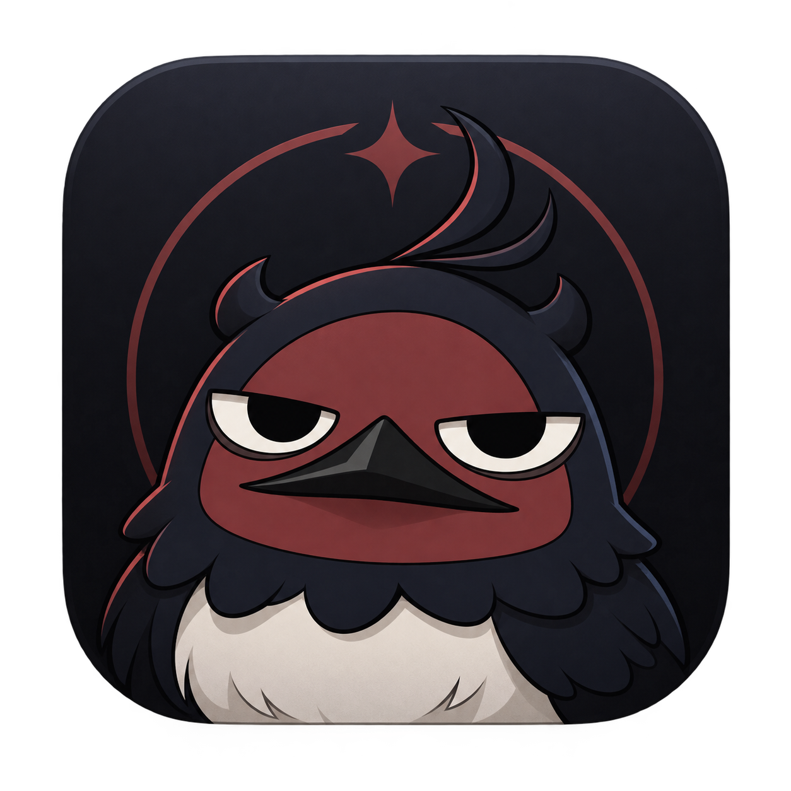

  

 

## Sobre mim

Sou **Técnico em Informática pela ETEC** e atualmente curso **Bacharelado em Ciência da Computação**.

Tenho interesse em desenvolvimento de software, inteligência artificial, automação e infraestrutura. Além da área de desenvolvimento, também trabalho com manutenção, formatação, configuração e diagnóstico de computadores e notebooks.

Atualmente desenvolvo o **NERO**, meu principal projeto pessoal: um assistente de inteligência artificial para desktop que reúne IA local, voz, memória, interface gráfica e diferentes sistemas de interação.

**São Paulo, Brasil**  
**Inglês:** Intermediário

## Tecnologias e ferramentas

### Linguagens

### Desenvolvimento e ferramentas

### Suporte e infraestrutura

## NERO

<table>
<tr>
<td width="68%" valign="top">

<h3>Assistente de Inteligência Artificial para Desktop</h3>

O <strong>NERO</strong> é um projeto pessoal voltado à criação de um assistente de IA para desktop com identidade visual própria e interação por voz.

O projeto combina diferentes componentes para criar uma experiência mais natural entre usuário e assistente, incluindo processamento local, memória, voz e estados visuais.

<h4>Principais recursos</h4>

<ul>
  <li>Inteligência artificial local</li>
  <li>Reconhecimento de voz</li>
  <li>Síntese de voz</li>
  <li>Sistema de memória e contexto</li>
  <li>Interface gráfica para desktop</li>
  <li>Estados visuais e animações</li>
  <li>Arquitetura modular</li>
  <li>Integração entre diferentes componentes</li>
</ul>

<h4>Tecnologias</h4>

  

<strong>Status:</strong> Projeto privado

</td>

<td width="32%" align="center" valign="middle">

</td>
</tr>
</table>

## Experiência prática

### Suporte e manutenção de computadores

Além dos projetos de desenvolvimento, também possuo experiência prática com computadores e notebooks.

- Formatação e instalação de sistemas
- Configuração de computadores e notebooks
- Diagnóstico e troubleshooting
- Instalação de drivers e softwares
- Montagem e manutenção de computadores
- Manutenção e configuração de periféricos
- Suporte técnico a usuários
- Diagnóstico de problemas de hardware e software
- Configuração e resolução de problemas no Windows
- Conhecimentos de redes TCP/IP, DNS e DHCP

## Formação

### Bacharelado em Ciência da Computação

**Anhanguera**  
Em andamento • Início em 2026

### Técnico em Informática

**ETEC**  
2024 – 2025

## Cursos complementares

### Programa Vem Saber — USP

| Curso | Carga horária |
| :--- | ---: |
| Robótica | 40h |
| Desenvolvimento de Aplicativos e Jogos | 40h |
| Super Tecnologias | 40h |

## Contato

